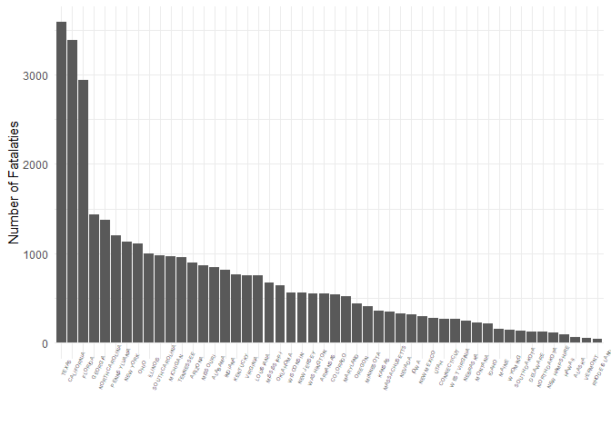
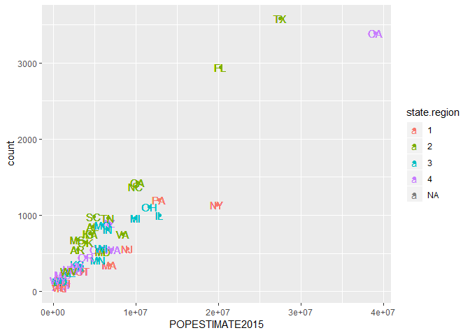
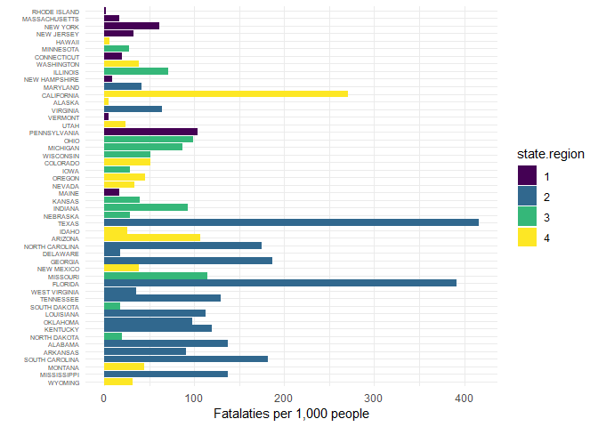

Homework 1: Motor vehicle traffic fatalities
================

``` r
knitr::opts_chunk$set(include = TRUE, comment = NA,
  fig.path = "HW_figs/HW1-",   
  message = FALSE,
  warning = FALSE)

## rmarkdown::render("Assignments/HW1.Rmd", "all") 
```

Motivation
----------

Your parents retired a few years ago and they are considering relocating into a retirement home. Currently, their top two choices for states to move to are Florida or California. While they are excited to live in some place new, they are worried about driving in their old age considering the motor vehicle traffic fatalities in Florida and California.


You want to recommend to your parents which state might be better or maybe even recommend a different state based on other preferences they may have, such as access to mass transit, weather, hiking, etc. You did some research and found the Fatality Analysis Reporting System (FARS) of the National Highway Traffic Safety Administration (NHTSA). You [read](https://www.nhtsa.gov/research-data/fatality-analysis-reporting-system-fars) that "FARS is a nationwide census providing NHTSA, Congress and the American public yearly data regarding fatal injuries suffered in motor vehicle traffic crashes". You decide to explore the dataset and other state-level features to be able to recommend a state for your parents to move to.

Some datasets that you will find useful are:

-   [2015 FARS data](ftp://ftp.nhtsa.dot.gov/fars/2015/National/FARS2015NationalDBF.zip) and [2015 FARS user guide](http://www.nber.org/fars/ftp.nhtsa.dot.gov/fars/FARS-DOC/Analytical%20User%20Guide/USERGUIDE-2015.pdf)
-   [Geographic Locator Codes (GLCs) for the U.S. and U.S. Territories](https://www.gsa.gov/reference/geographic-locator-codes/glcs-for-the-us-and-us-territories)
-   [US Census population totals by state for 2015](https://www.census.gov/data/tables/2017/demo/popest/state-total.html#par_textimage)
-   [Life Expectancy at Birth (in years)](https://www.kff.org/other/state-indicator/life-expectancy)

Problem 1
---------

### Problem 1.1

Read in the `accident.dbf` dataset into R from the 2015 FARS dataset and create a data frame called `acc`.

**Hint**: You might find the [foreign](https://cran.r-project.org/web/packages/foreign/index.html) R package useful here.

``` r
library(tidyverse)
library(foreign)
library(readxl)

acc <- read.dbf("~/Desktop/JHU-AdvDataScience/data/accident.dbf")
```

### Problem 1.2

You see first colum in the `acc` dataset (`STATE`) contains the Geographic Locator Code (GLC) for each US state. Read in the GLCs dataset for the US and US territories. Create a data frame called `states` that contains a state name and state GLC code in each row.

``` r
states_glc <- read_excel("~/Desktop/JHU-AdvDataScience/data/FRPP GLC United States.xlsx", 
    col_types = c("text", "text", "numeric", 
        "text", "text", "text", "text", "text", 
        "skip", "skip"))
terr_glc <- read_excel("~/Desktop/JHU-AdvDataScience/data/FRPP GLC US Territories.xlsx",
    col_types = c("text", "text", "text", 
        "text", "text", "text", "text", "text", 
        "text", "skip"))  ## dataset not needed ??

states <- states_glc %>% select(`State Name`,`State Code`) %>% distinct()
```

### Problem 1.3

Add the state abbreviation and region to the `states` data frame using the [state dataset](http://stat.ethz.ch/R-manual/R-devel/library/datasets/html/state.html) in R.

``` r
region <- cbind(state.abb,state.region)

states <- states %>% filter(`State Name` != "DISTRICT OF COLUMBIA") %>%
  cbind(.,region)
```

### Problem 1.4

Add the state name, abbreviation and region to the `acc` dataset.

``` r
acc <- merge(acc,states, by.x = "STATE", by.y = "State Code", all.x = TRUE)
```

### Problem 1.5

Add a column to the `acc` dataset containing the 2015 population total for each state.

``` r
pop <- read_csv("~/Desktop/JHU-AdvDataScience/data/nst-est2017-alldata.csv") %>%
  filter(NAME2 != c("UNITED STATES","NORHTEAST REGION", "MIDWEST REGION", "SOUTH REGION",
                  "WEST REGION")) %>% select(NAME2,POPESTIMATE2015)

acc <- merge(acc,pop, by.x ="State Name" , by.y = "NAME2", all.x = TRUE)
```

Problem 2
---------

Which states have the most motor vehicle fatalities?

### Problem 2.1

Calculate the total number of fatalities by state and visualize the results with a barplot. The x-axis should be names of the states and the y-axis should be the total number of fatalities. Order the barplot in descending order with the largest number of fatalities on the left side and the smallest on the right side.

``` r
acc %>% group_by(`State Name`) %>% select(FATALS) %>% summarise(count = sum(FATALS)) %>% filter(`State Name` != "NA") %>%
  ggplot(aes(reorder(`State Name`,-count),count)) + geom_col() +
  labs(x = "", y = "Number of Fatalaties") + theme_minimal() +
  theme(axis.text.x = element_text(angle = 65, size = 4.5))
```



Which states contain the most fatalities?

Texas

Which states contain the least?

Rhode Island

#### Add a summary of your findings here

### Problem 2.2

If we consider the top 3 states with the most fatalities, are there certain times of the year which are more or less problematic for these states? Create a data visualization (plot) to explore this question and summarize your findings.

**Hint**: Create a plot of fatalities across time. Read about the `as.Date()` function.

``` r
acc$date <- as.Date(with(acc,paste(YEAR,MONTH, DAY, sep="-")), "%Y-%m-%d")

acc %>% filter(`State Name` %in% c("TEXAS","CALIFORNIA","FLORIDA")) %>% 
  ggplot(aes(date,FATALS, color = `State Name`)) + geom_line() + 
  scale_color_viridis_d(option="plasma", direction = -1) + theme_minimal()
```


If there are states that have differences across time, why do you think that is?

#### Add a summary of your findings here

Problem 3
---------

Based on the lectures, we learned that healthcare spending and coverage was highly related to total population size. Let's explore how traffic fatalities are related to population size and other variables that might be relevant to your parents.

### Problem 3.1

Is there a relationship between total fatality and population size? How does this change across regions and states. Create a data visualization (plot) to explore this question and summarize your results.

**Hint**: Try coloring the states by regions and add the state abbreviations to the plot.

``` r
## add your code here

acc$state <- ifelse(acc$`State Name` == "NA", "D.C.", acc$`State Name`)

acc %>% group_by(state) %>%
  mutate(count = sum(FATALS)) %>%
  ggplot(aes(POPESTIMATE2015, count, color = state.region)) + geom_point() +
  geom_text(aes(label = state.abb, check_overlap = TRUE))
```



#### Add a summary of your findings here

### Problem 3.2

Instead of total number of fatalities, calculate the fatality rate (total number of fatalities divided by population size). How does the fatality rate change across regions and states? Create a data visualization (plot) to explore these questions and summarize your results.

``` r
## add your code here

acc %>% group_by(`State Name`) %>%
  mutate(count = sum(FATALS), prop = count/POPESTIMATE2015, rate = prop * 1000) %>%  filter(`State Name` != "NA") %>%
 ggplot(aes(reorder(`State Name`,-rate), rate)) + 
  geom_col(aes(fill = state.region)) + labs(x = "", y = "Fatalaties per 1,000 people") + coord_flip() + scale_fill_viridis_d() +
  theme_minimal() + theme(axis.text.y = element_text(size = 5.5))
```



Which states have the highest fatality rate? Which states have the lowest fatlity rate?

#### Add a summary of your findings here

### Problem 3.3

Is rate of traffic fatalities related to life expectancy? Create a data visualization (plot) to explore this question and summarize your results.

**Hint**: Color the states by regions and add the state abbreviations on top of your plot.

``` r
## add your code here

lifeExp <- read_excel("~/Desktop/JHU-AdvDataScience/data/KFF_rawdata.xlsx") %>%
  select(LE_years,StateCAPS)

lifemerge <- merge(acc,lifeExp, by.x = "State Name", by.y = "StateCAPS", all.x = TRUE)

lifemerge %>% group_by(`State Name`) %>%
  mutate(count = sum(FATALS), prop = count/POPESTIMATE2015, rate = prop * 1000) %>%  filter(`State Name` != "NA") %>%
  ggplot(aes(rate,LE_years, color = state.region)) + geom_point() +
  stat_smooth(method = "lm") + scale_x_continuous(labels = scales::percent) +
  scale_color_viridis_d() + theme_minimal() +
  geom_text(aes(label = state.abb, check_overlap = TRUE)) +
  labs(x = "Fatalities per 1,000 people", y = "Life Expectancy (in years)")
```


#### Add a summary of your findings here

Problem 4
---------

As your parents are now retired, they have three additional other concerns:

1.  How much a state spends on medicare
2.  Living in warm weather
3.  Access to several large cosmopolitan cities.

Given what you have learned in this homework assignment, investigate these three additional concerns from your parents by looking at other datasets that would be useful in helping them decide where to live. You can use whatever sources of data that you think best help make a recommendation for your parents on where to move to for their retirement.

**Note:** There is no wrong answer, but to get full credit, a complete response to this quesion should include: (1) recommendations of states to move to, (2) additional exploratory data analyses investigating the three additional concerns from your parents, and (3) a summary of the findings from the data analyzed in the three previous problems and/or other datasets that you think are relevant given their additional three concerns listed above.

#### Add a summary of your findings here
